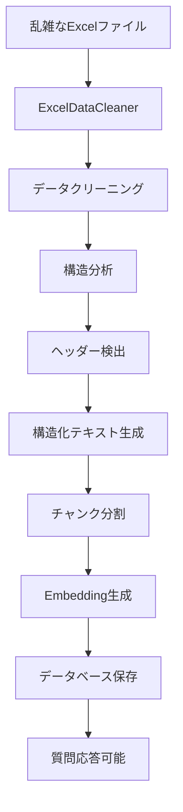

# 🗂️ 乱雑なExcelデータ処理ガイド

## 📋 概要

このガイドでは、アップロードされた乱雑なExcelファイル（XLS/XLSX）を効果的に処理し、チャットボットが質問に答えられるように構造化する方法を説明します。

## 🚨 問題の背景

### よくある乱雑なExcelデータの例
```
0    6    キャンセル                           ○    フォーバル  SS0101868  900101868
     ＴＥＮ Ｇｒｅｅｎ Ｆａｃｔｏｒｙ 株式会社   438-0803   静岡県
静岡県磐田市富丘905-1 サンキョウハイツ201号              鈴木貴博        ビジサポ部
梅沢佑真 2022-04-19 00:00:00        -    NaT    ISPH00365  朝日ネット
                                   固定なし  ファミリー  SHSタイプ隼  800
                                                              あり
21109680                    CAF5325209664
2022-05-09 00:00:00  西野  00:00:00
-
-
キャンセル                          不要
1  とか
NaT
NaT
とかあってこういうのって質問しても回答できなかったりするんだけどどうしたらいい
```

### 問題点
- **構造がない**: ヘッダーと データが混在
- **空白セルが多い**: 意味のないデータが散在
- **データが分散**: 関連情報が複数行に分かれている
- **形式が不統一**: 日付、数値、テキストが混在
- **文字化けや特殊文字**: 全角・半角の混在

## 🛠️ 解決策

### 1. 強化されたExcelデータクリーナー

新しく作成した [`ExcelDataCleaner`](modules/excel_data_cleaner.py) クラスが以下の処理を行います：

#### 📊 データクリーニング機能
- **空白除去**: 意味のない空行・空列を削除
- **文字正規化**: Unicode正規化、全角半角統一
- **重複削除**: 同じ内容の行を統合
- **長すぎるセルの切り詰め**: 1000文字以上のセルを適切にカット

#### 🔍 構造分析機能
- **ヘッダー検出**: キーワードベースでヘッダー行を自動識別
- **データタイプ分析**: 数値、日付、テキストを自動判別
- **意味のある行の抽出**: 最低限の情報を含む行のみを保持

#### 📝 構造化出力
- **ヘッダーあり形式**: `項目名: 値` の形式で出力
- **ヘッダーなし形式**: `行番号: データ1 | データ2 | ...` の形式
- **統計情報**: データ充填率、行数、列数などの要約

### 2. 処理フロー



## 🧪 テスト方法

### テストスクリプトの実行
```bash
cd workmate/Chatbot-backend-main
python test_messy_excel_processing.py
```

### 期待される出力例
```
=== シート: 乱雑なデータ ===
【データ項目】
- 会社名
- 住所
- 担当者
- 部署
- 契約日
- ステータス

【データ内容】
• 会社名: ＴＥＮ Ｇｒｅｅｎ Ｆａｃｔｏｒｙ 株式会社 | 住所: 静岡県磐田市富丘905-1 | 担当者: 鈴木貴博
• 部署: ビジサポ部 | 契約日: 2022-04-19 | ステータス: キャンセル

【データ統計】
総行数: 18 | 総列数: 10 | データ充填率: 23.3%
```

## 🎯 使用方法

### 1. システム統合
新しいExcelクリーナーは [`document_processor.py`](modules/document_processor.py) の [`_extract_text_from_excel()`](modules/document_processor.py:759) メソッドに統合済みです。

### 2. 自動フォールバック
- 強化版の処理が失敗した場合、従来の処理に自動的にフォールバック
- エラーログで処理状況を確認可能

### 3. ファイルアップロード時の自動処理
```python
# ファイルアップロード時に自動的に実行される
processor = DocumentProcessor()
result = await processor.process_uploaded_file(file, user_id, company_id)
```

## 📈 改善効果

### Before（従来の処理）
```
=== シート: Sheet1 ===
0    6    キャンセル    NaN    NaN    NaN    ○    フォーバル    SS0101868    900101868
NaN    NaN    ＴＥＮ Ｇｒｅｅｎ Ｆａｃｔｏｒｙ 株式会社    438-0803    NaN    静岡県    NaN    NaN    NaN    NaN
...（読みにくい生データ）
```

### After（強化版処理）
```
=== シート: 乱雑なデータ ===
【データ内容】
行1: キャンセル | フォーバル | SS0101868 | 900101868
行2: ＴＥＮ Ｇｒｅｅｎ Ｆａｃｔｏｒｙ 株式会社 | 438-0803 | 静岡県
行3: 静岡県磐田市富丘905-1 サンキョウハイツ201号 | 鈴木貴博 | ビジサポ部
行4: 梅沢佑真 | 2022-04-19 00:00:00 | ISPH00365 | 朝日ネット
...（構造化された読みやすいデータ）
```

## 🔧 カスタマイズ設定

### ExcelDataCleanerの設定項目
```python
class ExcelDataCleaner:
    def __init__(self):
        self.min_meaningful_length = 3      # 意味のあるデータの最小文字数
        self.max_cell_length = 1000         # セル内容の最大文字数
```

### ヘッダー検出キーワード
```python
header_keywords = [
    '名前', 'name', '会社', 'company', '住所', 'address', 
    '電話', 'phone', 'tel', '日付', 'date', 'id', 'no',
    '番号', '種類', 'type', '状態', 'status', '金額', 'amount'
]
```

## 🚀 今後の改善予定

### 1. AI支援による構造推定
- LLMを使用してデータの意味を理解
- より高精度なヘッダー検出
- 関連データの自動グループ化

### 2. 業界固有の対応
- 業界別のデータパターン学習
- 専門用語辞書の追加
- カスタムクリーニングルール

### 3. データ品質評価
- データ品質スコアの算出
- 改善提案の自動生成
- ユーザーへのフィードバック

## 💡 ベストプラクティス

### 1. ファイルアップロード前の準備
- 可能な限りヘッダー行を明確にする
- 空白行・列を事前に削除
- 関連データを近くに配置

### 2. 質問の仕方
**❌ 悪い例**: "このファイルについて教えて"
**✅ 良い例**: "鈴木貴博さんの会社名と住所を教えて"

### 3. データの確認
- 処理後のテキストをプレビュー
- 重要な情報が抽出されているか確認
- 必要に応じて再アップロード

## 🆘 トラブルシューティング

### よくある問題と解決策

#### 1. "処理可能なデータが見つかりません"
**原因**: 全てのセルが空白または意味のないデータ
**解決策**: ファイル内容を確認し、有効なデータがあるか確認

#### 2. "質問に答えられない"
**原因**: データが適切に構造化されていない
**解決策**: より具体的な質問をするか、ファイルを整理して再アップロード

#### 3. "文字化けが発生"
**原因**: 文字エンコーディングの問題
**解決策**: ファイルをUTF-8で保存し直してアップロード

## 📞 サポート

問題が解決しない場合は、以下の情報と共にサポートにお問い合わせください：
- アップロードしたファイルのサンプル
- エラーメッセージ
- 期待していた結果
- 実際の結果

---

**📝 注意**: このシステムは継続的に改善されています。新機能や改善点があれば、このガイドも更新されます。