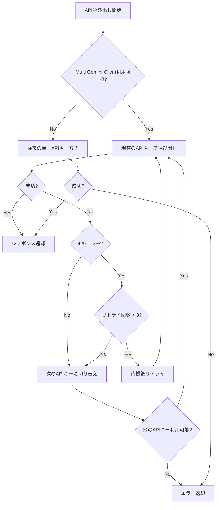

# 🔄 複数Gemini APIキー対応システム

## 概要

このシステムは、Gemini APIのレート制限（429エラー）に対応するため、複数のAPIキーを自動的に切り替える機能を提供します。

## 主な機能

- ✅ **自動APIキー切り替え**: レート制限に達したら自動的に次のAPIキーに切り替え
- ✅ **リトライ機能**: 各APIキーで最大3回まで自動リトライ
- ✅ **状態管理**: 各APIキーの状態（アクティブ/制限中/エラー）を追跡
- ✅ **フォールバック**: 従来の単一APIキー方式への自動フォールバック
- ✅ **ログ出力**: 詳細な状態情報とエラーログ

## 設定方法

### 1. 環境変数の設定

`.env`ファイルに以下の環境変数を追加してください：

```bash
# メインAPIキー（必須）
GEMINI_API_KEY=your_first_api_key_here

# 追加APIキー（オプション、レート制限対応のため推奨）
GEMINI_API_KEY_2=your_second_api_key_here
GEMINI_API_KEY_3=your_third_api_key_here
GEMINI_API_KEY_4=your_fourth_api_key_here
GEMINI_API_KEY_5=your_fifth_api_key_here
```

### 2. APIキーの取得

1. [Google AI Studio](https://aistudio.google.com/app/apikey) にアクセス
2. 新しいAPIキーを作成
3. 複数のAPIキーを作成することを推奨（レート制限対応のため）

### 3. 設定スクリプトの実行

```bash
cd workmate/Chatbot-backend-main
python setup_multi_api_keys.py
```

## システム構成

### 新しいファイル

1. **`modules/multi_gemini_client.py`**
   - 複数APIキー管理のメインクラス
   - レート制限検出と自動切り替え機能
   - エラーハンドリングとリトライ機能

2. **`setup_multi_api_keys.py`**
   - APIキー設定支援スクリプト
   - 現在の設定状況確認
   - 対話的設定機能

### 更新されたファイル

1. **`modules/realtime_rag.py`**
   - Multi Gemini Clientの統合
   - 従来方式へのフォールバック機能
   - 改善されたエラーハンドリング

2. **`modules/config.py`**
   - 複数APIキー対応の設定関数追加
   - APIキー数確認機能

## 動作フロー



## エラーハンドリング

### レート制限エラー（429）の処理

1. **検出**: HTTPステータス429またはエラーメッセージから自動検出
2. **リトライ**: 指数バックオフ（2秒、4秒、8秒）でリトライ
3. **切り替え**: 最大リトライ回数に達したら次のAPIキーに切り替え
4. **リセット**: 60秒後に制限状態をリセット

### その他のエラー

- **タイムアウト**: 10分でタイムアウト、次のAPIキーに切り替え
- **認証エラー**: そのAPIキーを無効化、次のAPIキーに切り替え
- **その他**: エラーログ出力後、次のAPIキーに切り替え

## 状態監視

### ログ出力例

```
✅ Gemini APIクライアント gemini_client_1 初期化完了
🔄 APIキー切り替え: gemini_client_2
⚠️ gemini_client_1 レート制限エラー: API Rate Limit (429)
⏳ 2秒待機後にリトライ (試行 1)
📊 Multi Gemini Client状態:
   gemini_client_1: rate_limited (リトライ: 3/3)
   gemini_client_2: active (リトライ: 0/3)
```

### 状態情報API

```python
from modules.multi_gemini_client import get_multi_gemini_client

client = get_multi_gemini_client()
status_info = client.get_status_info()
print(status_info)
```

## トラブルシューティング

### よくある問題

1. **「Multi Gemini Client利用不可」エラー**
   - 解決: 環境変数`GEMINI_API_KEY`が設定されているか確認

2. **「最大リトライ回数に達しました」エラー**
   - 解決: 追加のAPIキーを設定するか、しばらく待ってから再試行

3. **「API制限のため、しばらく待ってから再度お試しください」エラー**
   - 解決: 全てのAPIキーがレート制限に達している状態。時間をおいて再試行

### デバッグ方法

1. **設定確認**:
   ```bash
   python setup_multi_api_keys.py
   ```

2. **ログ確認**: アプリケーションログで各APIキーの状態を確認

3. **手動テスト**:
   ```python
   from modules.multi_gemini_client import multi_gemini_available
   print(f"Multi Gemini利用可能: {multi_gemini_available()}")
   ```

## パフォーマンス

- **レスポンス時間**: 通常時は従来と同等
- **レート制限時**: 自動切り替えにより継続的なサービス提供
- **メモリ使用量**: 最小限の追加メモリ使用

## セキュリティ

- APIキーはログに出力されません（末尾8文字のみ表示）
- 環境変数での安全な管理
- エラーメッセージにAPIキーは含まれません

## 今後の拡張予定

- [ ] 動的レート制限調整
- [ ] APIキー使用量統計
- [ ] Webhook通知機能
- [ ] 自動APIキー追加機能

## サポート

問題が発生した場合は、以下の情報を含めてお問い合わせください：

1. エラーメッセージ
2. ログファイル
3. 設定されているAPIキー数
4. 実行環境情報