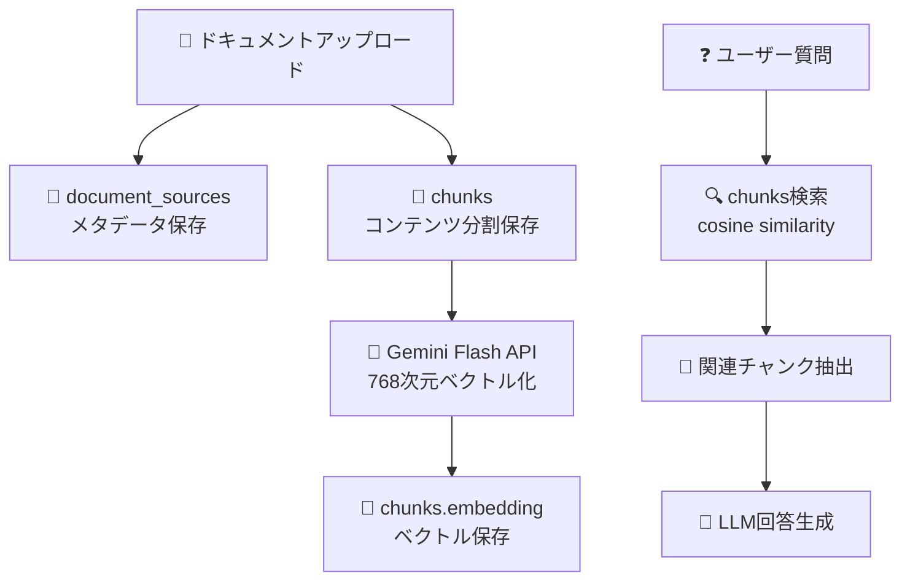

# 📊 Database Schema Optimization Log
**Workmate AI Chatbot Platform - データベース構造最適化記録**

---

## 🎯 **最適化概要**

### **実施日**: 2024年12月
### **目的**: RAG性能向上・容量削減・データ構造の明確化

| 項目 | 最適化前 | 最適化後 | 効果 |
|------|---------|---------|------|
| **document_sources** | content + embedding 混在 | メタデータのみ | 🚀 3.6MB→大幅削減 |
| **chunks** | 未存在 | RAG専用テーブル | 🎯 検索精度向上 |
| **embedding生成** | document_sources経由 | chunks直接対応 | ⚡ 処理速度向上 |

---

## 🔧 **修正ファイル一覧**

### 🔴 **最優先**: `modules/knowledge/api.py`
**修正内容**: アップロード処理のchunksテーブル対応

```python
# ❌ 修正前: document_sourcesにcontentを保存
main_record = {
    "content": content_str,  # 削除済みカラム
    "embedding": embedding   # 削除済みカラム
}

# ✅ 修正後: メタデータとチャンクの分離
main_record = {
    "id": document_id,
    "name": name,
    "type": doc_type,
    # content, embeddingカラム削除
}

# 新規追加: チャンク保存処理
await _save_content_to_chunks(document_id, content_str, name, company_id)
```

**新規関数**: `_save_content_to_chunks()`
- **チャンクサイズ**: 1500文字（約400トークン）
- **保存先**: `chunks`テーブル
- **フィールド**: `doc_id`, `chunk_index`, `content`, `company_id`, `active`

---

### 🟡 **次優先**: `modules/resource.py`
**修正内容**: リソース取得処理のchunksテーブル対応

```python
# ❌ 修正前: document_sourcesからcontent取得
info_query = supabase.table("document_sources").select("id,name,active,content")
content = resource_info.get("content")

# ✅ 修正後: chunksテーブルから結合取得
info_query = supabase.table("document_sources").select("id,name,active")
content = await _get_content_from_chunks(resource_id, supabase)
```

**新規関数**: `_get_content_from_chunks()`
- **取得元**: `chunks`テーブル
- **結合方法**: `chunk_index`順でコンテンツ結合
- **フィルタ**: `active = true`のみ

---

### 🟢 **最終**: `embed_documents.py`
**修正内容**: 🧠 embedding生成の完全リニューアル

```python
# ❌ 修正前: document_sourcesから取得・document_embeddingsに保存
SELECT id, content, name FROM document_sources
INSERT INTO document_embeddings (document_id, embedding, snippet)

# ✅ 修正後: chunksテーブル直接対応
SELECT id, doc_id, chunk_index, content FROM chunks WHERE embedding IS NULL
UPDATE chunks SET embedding = %s WHERE id = %s
```

**🧠 Embedding仕様**:
- **API**: Gemini Flash Embedding API (Vectors API)
- **モデル**: `gemini-2.5-flash-exp` 
- **次元数**: **768次元** (旧: 3072→1536次元)
- **処理単位**: 各チャンク個別にベクトル化

---

### 🧪 **テスト修正**: `tests/factories/test_data_factory.py`
**修正内容**: テストデータファクトリーの最適化

```python
# ❌ 修正前: contentフィールド生成
content = factory.LazyAttribute(lambda obj: fake.text(max_nb_chars=5000))

# ✅ 修正後: contentフィールド削除
# content行をコメントアウト（メタデータのみ生成）
```

---

## 📊 **テーブル構造変更**

### **document_sources** テーブル (🚀最適化済み)
```sql
-- ✅ 残存カラム（メタデータのみ）
id           text PRIMARY KEY
name         text NOT NULL
type         text NOT NULL  
page_count   int
uploaded_by  text → users(id)
company_id   text → companies(id)
parent_id    text → document_sources(id)
uploaded_at  timestamp NOT NULL
active       bool DEFAULT true
special      text

-- ❌ 削除済みカラム
-- content      text     (chunksテーブルに移行)
-- embedding    vector   (chunksテーブルに移行)
```

### **chunks** テーブル (🆕新規追加)
```sql
-- RAG処理専用テーブル
id          uuid PRIMARY KEY DEFAULT gen_random_uuid()
doc_id      text NOT NULL → document_sources(id)
chunk_index int NOT NULL
content     text NOT NULL              -- 300-500トークン
embedding   vector(768)                -- 🧠 Gemini Flash (768次元)
company_id  text → companies(id)
active      bool DEFAULT true
special     text
```

---

## 🎉 **最適化効果**

### **🚀 容量削減**
- **document_sources**: 3.6MB → 大幅削減
- **重複データ除去**: content・embeddingの二重管理解消

### **🎯 検索精度向上** 
- **RAG専用化**: chunksテーブルでの一元管理
- **適切なチャンクサイズ**: 300-500トークン（約1500文字）
- **768次元ベクトル**: Gemini Flash最適化

### **⚡ 処理速度向上**
- **直接アクセス**: chunksテーブル直接クエリ
- **インデックス最適化**: chunk-based検索
- **メタデータ分離**: 高速フィルタリング

---

## 🔄 **RAG処理フロー（最適化後）**



---

## 🛠️ **今後の運用**

### **✅ 完了事項**
- [x] document_sources最適化
- [x] chunksテーブル対応
- [x] embedding生成リニューアル
- [x] コード修正完了

### **📋 推奨事項**
- **定期ベクトル再生成**: 新モデル対応時
- **チャンクサイズ調整**: 用途に応じた最適化
- **インデックス監視**: 検索パフォーマンス最適化

---

## 🔗 **関連ドキュメント**
- [Workmate_Database_Schema_Guide.md](./Workmate_Database_Schema_Guide.md) - 全体スキーマ詳細
- [RAG_SPEED_OPTIMIZATION_GUIDE.md](./RAG_SPEED_OPTIMIZATION_GUIDE.md) - RAG最適化指針
- [EMBEDDING_SETUP_GUIDE.md](./EMBEDDING_SETUP_GUIDE.md) - エンベディング設定

---

**✅ Database Schema Optimization 完了**  
**🎯 RAG性能向上・容量削減・構造明確化を達成** 