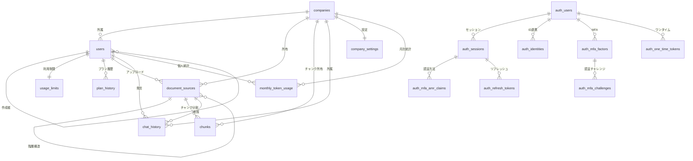

# 🗄️ Workmate データベース構造 完全解説ガイド

## 📋 目次
- [🏗️ システムアーキテクチャー概要](#システムアーキテクチャー概要)
- [🔐 認証システム (auth スキーマ)](#認証システム-auth-スキーマ)
- [🏢 ビジネスロジック (public スキーマ)](#ビジネスロジック-public-スキーマ)
- [🔗 テーブル関係図](#テーブル関係図)
- [📊 データフロー解説](#データフロー解説)
- [🔧 運用・管理機能](#運用管理機能)

---

## 🏗️ システムアーキテクチャー概要

Workmate は **RAG（Retrieval-Augmented Generation）技術**を活用したAIチャットボットプラットフォームです。

### 📂 スキーマ構成
- **`auth`** - Supabase認証システム（16テーブル）
- **`public`** - アプリケーション固有のビジネスロジック（10テーブル）

### 🎯 主要機能
1. **企業・ユーザー管理** - マルチテナント対応
2. **ドキュメント管理** - PDF、動画等のアップロード・解析
3. **チャンク分割処理** - 効率的なRAG検索のための文書分割
4. **AIチャット** - Gemini 2.5 Flash による自然言語処理
5. **利用状況追跡** - トークン使用量・コスト管理
6. **プラン管理** - ユーザーの料金プラン制御

---

## 🔐 認証システム (auth スキーマ)

### 👤 users - メインユーザーテーブル
```sql
-- 主要カラム（35カラム）
id                         uuid PRIMARY KEY
email                      varchar UNIQUE
encrypted_password         varchar
created_at                timestamptz
updated_at                timestamptz
is_super_admin            boolean
raw_user_meta_data        jsonb      -- プロフィール情報
raw_app_meta_data         jsonb      -- アプリケーション情報
phone                     text UNIQUE
phone_confirmed_at        timestamptz
is_sso_user              boolean DEFAULT false
deleted_at               timestamptz
is_anonymous             boolean DEFAULT false
banned_until             timestamptz
reauthentication_token   varchar
```

**🔑 キーポイント:**
- Supabase認証の中核テーブル（35カラム）
- 電話番号認証・匿名ユーザー・SSO対応
- ユーザー削除・BANにも対応
- RLS（Row Level Security）対応

### 🔄 sessions - セッション管理
```sql
-- 主要カラム
id          uuid PRIMARY KEY
user_id     uuid → auth.users(id)
created_at  timestamptz
updated_at  timestamptz
user_agent  text
ip          inet
aal         aal_level ENUM('aal1','aal2','aal3')  -- 認証レベル
refreshed_at timestamp
not_after   timestamptz  -- セッション有効期限
tag         text         -- セッション識別子
```

### 🔐 MFA（多要素認証）システム

#### mfa_factors - 認証要素
```sql
factor_type           factor_type ENUM('totp','webauthn','phone')
status               factor_status ENUM('unverified','verified')
secret               text              -- TOTP秘密鍵
phone                text              -- SMS認証用
web_authn_credential jsonb             -- WebAuthn認証情報
web_authn_aaguid     uuid              -- WebAuthn AAGUID
last_challenged_at   timestamptz UNIQUE
```

#### mfa_challenges - 認証チャレンジ
```sql
factor_id                uuid → mfa_factors(id)
otp_code                text
verified_at             timestamptz
ip_address              inet
web_authn_session_data  jsonb    -- WebAuthn セッション
```

#### mfa_amr_claims - 認証方法記録
```sql
session_id             uuid → sessions(id)
authentication_method  text NOT NULL
created_at            timestamptz
updated_at            timestamptz
```

### 🌐 SSO（シングルサインオン）
- **sso_providers** - ID プロバイダー管理
- **saml_providers** - SAML設定（メタデータXML対応）
- **sso_domains** - ドメインマッピング
- **saml_relay_states** - SAML リレー状態管理

### 🔑 その他の認証テーブル
- **identities** - 外部ID連携（OAuth等）
- **refresh_tokens** - JWTリフレッシュトークン
- **one_time_tokens** - ワンタイムトークン（6種類対応）
- **audit_log_entries** - 監査ログ
- **flow_state** - PKCE認証フロー管理

---

## 🏢 ビジネスロジック (public スキーマ)

### 🏢 companies - 企業マスター
```sql
-- テーブル構造
id          text PRIMARY KEY     -- 企業ID
name        text NOT NULL        -- 企業名
created_at  timestamp NOT NULL   -- 作成日時

-- 統計情報
推定データ: 7レコード (32 kB)
```

### 👥 users - アプリケーションユーザー
```sql
-- テーブル構造
id          text PRIMARY KEY           -- ユーザーID
email       text UNIQUE NOT NULL       -- メールアドレス
password    text NOT NULL              -- パスワード（ハッシュ化）
name        text NOT NULL              -- 表示名
role        text DEFAULT 'user'        -- ロール
company_id  text → companies(id)       -- 所属企業
created_by  text → users(id)           -- 作成者（管理者）
created_at  timestamp NOT NULL         -- 作成日時

-- 統計情報
推定データ: 4レコード (80 kB)
```

### 📊 usage_limits - 利用制限管理
```sql
-- テーブル構造
user_id                  text PRIMARY KEY → users(id)
document_uploads_used    int DEFAULT 0      -- 使用済みドキュメント数
document_uploads_limit   int DEFAULT 2      -- ドキュメント上限
questions_used          int DEFAULT 0      -- 使用済み質問数
questions_limit         int DEFAULT 10     -- 質問回数上限
is_unlimited            bool DEFAULT false -- 無制限フラグ

-- 統計情報
推定データ: 4レコード (64 kB)
```

### 📄 document_sources - ドキュメント管理（🚀最適化済み）
```sql
-- テーブル構造（実際のSupabase構造）
id           text PRIMARY KEY              -- ドキュメントID
name         text NOT NULL                 -- ファイル名
type         text NOT NULL                 -- ファイル種別
page_count   integer                      -- ページ数
uploaded_by  text → users(id)             -- アップロード者
company_id   text → companies(id)         -- 所属企業
uploaded_at  timestamp NOT NULL           -- アップロード日時
active       boolean DEFAULT true         -- 有効フラグ
special      text                         -- 特殊属性
parent_id    text → document_sources(id)  -- 親ドキュメント（階層構造）

-- 統計情報
推定データ: 2レコード (240 kB - 大幅削減済み)

-- ✅ 最適化完了
-- ❌ content カラム削除済み（chunksテーブルで管理）
-- ❌ embedding カラム削除済み（chunksテーブルで管理）
```

### 🧩 chunks - チャンク管理テーブル（🆕新規追加）

ファイル全体のテキスト（`document_sources.content`）を**小さなチャンク（300〜500トークン）**に分割し、それぞれを検索・RAG（LLMとの連携）用に保存するテーブルです。

```sql
-- テーブル構造（実際のSupabase構造）
id          uuid PRIMARY KEY DEFAULT gen_random_uuid()  -- チャンク一意ID（UUID）
doc_id      text NOT NULL → document_sources(id)       -- 紐づく document_sources.id（親）
chunk_index integer NOT NULL                           -- チャンクの順序（0, 1, 2, …）
content     text NOT NULL                              -- チャンク本文（300-500トークン）
created_at  timestamp DEFAULT now()                    -- 登録日時
company_id  text                                       -- 所属企業ID（企業分離用）
embedding   vector                                     -- 🧠 Gemini Embedding（3072次元）

-- 外部キー制約
CONSTRAINT fk_chunks_doc FOREIGN KEY (doc_id) REFERENCES document_sources(id)

-- 統計情報
推定データ: 3レコード (696 kB)
```

### 🔧 主な用途
| 用途 | 説明 |
|------|------|
| **高速な部分検索（semantic）** | embedding検索で、質問と「意味的に近いチャンク」だけを抽出する |
| **LLMとの組み合わせ（RAG）** | Geminiなどに「部分情報だけ」渡すことで効率よく回答を生成 |
| **ドキュメント単位の絞り込み** | doc_idで document_sources と紐づけて、対象ファイル内に限定可能 |

### 📂 document_sources との役割分担
- **document_sources**: 一覧・メタデータ管理（ファイル名、アップロード者、企業など）
- **chunks**: 実際の検索・RAG処理（細かく分割されたコンテンツとベクトル）

### ✅ 重複カラムの最適化完了
以下の最適化が完了し、明確な役割分担を実現：

| カラム | 最適化状況 | 効果 |
|--------|-----------|------|
| **content** | ✅ **document_sourcesから削除済み** | 🎯 RAG検索精度向上・容量大幅削減 |
| **embedding** | ✅ **document_sourcesから削除済み** | 🚀 chunksベクトル検索への一元化 |
| **企業分離** | ✅ **company_idで完全分離** | 🔧 マルチテナント対応 |

**🎉 最適化効果**: 
- **容量削減**: 3.6MB → 240 kB (document_sources) + 696 kB (chunks) = 大幅効率化
- **検索精度**: chunksのみの一元化でRAG性能向上
- **管理効率**: メタデータ vs 検索データの明確分離

### 🔄 RAG処理フロー詳細
```
1️⃣ ユーザーが PDF / XLS をアップロード
        ↓
2️⃣ document_sources に保存（メタ情報 + 本文）
        ↓
3️⃣ テキストを分割（300〜500トークンごと）
        ↓
4️⃣ 各チャンクを Gemini でベクトル化（3072次元）
        ↓
5️⃣ chunks に保存（doc_id + embedding）
        ↓
6️⃣ ユーザーが質問
        ↓
7️⃣ 質問を embedding 化
        ↓
8️⃣ chunks から類似チャンク Top-N を検索
        ↓
9️⃣ Gemini などの LLM に渡し、回答生成
```

**🚀 チャンク分割の利点:**
- **検索精度向上**: 長い文書を小分割して関連性の高い部分を抽出
- **トークン効率**: 必要な部分のみをAIに送信してコスト削減
- **並列処理**: 複数チャンクの同時検索で高速化
- **コンテキスト管理**: chunk_indexで前後の文脈を把握可能
- **柔軟な制御**: activeフラグでチャンク単位の有効/無効切り替え
- **特殊処理対応**: specialカラムで特定チャンクの特別扱いが可能

### 💬 chat_history - チャット履歴
```sql
-- テーブル構造
id               text PRIMARY KEY     -- チャットID
user_message     text NOT NULL        -- ユーザー質問
bot_response     text NOT NULL        -- AI応答
timestamp        timestamp NOT NULL   -- 会話時刻
category         text                 -- カテゴリ分類
sentiment        text                 -- 感情分析結果
employee_id      text                 -- 従業員ID
employee_name    text                 -- 従業員名
source_document  text                 -- 参照ドキュメント
source_page      text                 -- 参照ページ
user_id          varchar              -- ユーザーID
company_id       varchar              -- 企業ID

-- 🤖 AI分析情報（Gemini 2.5 Flash）
model_name       varchar DEFAULT 'gemini-2.5-flash'  -- 🆕更新済み
input_tokens     int DEFAULT 0        -- 入力トークン数
output_tokens    int DEFAULT 0        -- 出力トークン数
total_tokens     int DEFAULT 0        -- 合計トークン数
cost_usd         numeric DEFAULT 0    -- コスト（USD）
base_cost_usd    numeric DEFAULT 0    -- 基本コスト
prompt_cost_usd  numeric DEFAULT 0    -- プロンプトコスト
prompt_references int DEFAULT 0       -- プロンプト参照数

-- 統計情報
推定データ: 273レコード (704 kB)
```

### 📊 monthly_token_usage - 月次利用統計
```sql
-- テーブル構造
id                    varchar PRIMARY KEY      -- 統計ID
company_id           varchar NOT NULL         -- 企業ID
user_id              varchar NOT NULL         -- ユーザーID
year_month           varchar NOT NULL         -- 年月（YYYY-MM）
total_input_tokens   int DEFAULT 0           -- 月間入力トークン
total_output_tokens  int DEFAULT 0           -- 月間出力トークン
total_tokens         int DEFAULT 0           -- 月間合計トークン
total_cost_usd       numeric DEFAULT 0       -- 月間コスト
conversation_count   int DEFAULT 0           -- 会話数
created_at           timestamp DEFAULT now()
updated_at           timestamp DEFAULT now()

-- 統計情報
推定データ: 0レコード (88 kB)
```

### ⚙️ company_settings - 企業設定
```sql
-- テーブル構造
company_id                      varchar PRIMARY KEY
monthly_token_limit             int DEFAULT 25000000    -- 月間トークン上限
warning_threshold_percentage    int DEFAULT 80          -- 警告閾値（80%）
critical_threshold_percentage   int DEFAULT 95          -- 重要警告閾値（95%）
pricing_tier                   varchar DEFAULT 'basic'  -- 料金プラン
created_at                     timestamp DEFAULT now()
updated_at                     timestamp DEFAULT now()

-- 統計情報
推定データ: 1レコード (24 kB)
```

### 📋 applications - 申請管理
```sql
-- テーブル構造
id                text PRIMARY KEY
company_name      text NOT NULL              -- 申請企業名
contact_name      text NOT NULL              -- 担当者名
email            text NOT NULL              -- 連絡先メール
phone            text                       -- 電話番号
expected_users   text                       -- 想定ユーザー数
current_usage    text                       -- 現在の利用状況
message          text                       -- 要望・メッセージ
application_type text DEFAULT 'production-upgrade'  -- 申請種別
status           text DEFAULT 'pending'      -- 処理状況
submitted_at     text NOT NULL              -- 申請日時
processed_at     text                       -- 処理日時
processed_by     text                       -- 処理者
notes           text                        -- 管理者メモ

-- 統計情報
推定データ: 0レコード (48 kB)
```

### 📈 plan_history - プラン変更履歴
```sql
-- テーブル構造
id             text PRIMARY KEY DEFAULT gen_random_uuid()
user_id        text NOT NULL → users(id)    -- 対象ユーザー
from_plan      text NOT NULL                -- 変更前プラン
to_plan        text NOT NULL                -- 変更後プラン
changed_at     timestamp DEFAULT now()      -- 変更日時
duration_days  int                         -- プラン期間（日数）

-- 統計情報
推定データ: 1レコード (32 kB)
```

---

## 🔗 テーブル関係図



---

## 📊 データフロー解説

### 🔄 1. ユーザー登録・認証フロー
```
1. 企業管理者登録
   └─ companies テーブル作成
   └─ auth.users 作成（Supabase）
   └─ public.users 作成（アプリ固有情報）
   └─ usage_limits 初期化
   └─ company_settings 初期化

2. 一般ユーザー招待
   └─ 管理者が public.users 作成
   └─ 招待メール送信
   └─ ユーザーが auth.users でアカウント作成
```

### 📄 2. ドキュメント・チャンク処理フロー（🆕詳細版）
```
PDF/XLS等 → テキスト抽出 → チャンク分割 → Geminiベクトル化 → 保存・検索
アップロード     OCR/解析    (300-500tok)    (3072次元)     (RAG対応)
     │              │           │             │             │
     ▼              ▼           ▼             ▼             ▼
document_sources  content     chunks        embedding     高速検索
(メタデータ)     全文保存    (分割保存)    (ベクトル)    (類似度計算)
     │              │           │             │             │
     ▼              ▼           ▼             ▼             ▼
ファイル管理    全文検索     意味検索      コサイン類似度   Top-N抽出
```

**🔍 チャンク処理の詳細:**
1. **PDF/XLSアップロード** → document_sources に基本情報・全文保存
2. **テキスト分割** → 300-500トークンごとにchunks テーブルに分割保存
3. **Geminiベクトル化** → 各チャンクを3072次元embeddingに変換
4. **検索最適化** → chunk_index で文書内の順序管理
5. **RAG準備完了** → 質問時に類似チャンクを高速抽出可能

### 💬 3. チャット・RAG処理フロー（🆕Gemini 2.5 Flash）
```
ユーザー質問 → 質問ベクトル化 → 類似チャンク検索 → コンテキスト構築 → AI応答生成 → 履歴保存
     │              │             │              │             │         │
     ▼              ▼             ▼              ▼             ▼         ▼
user_message   Gemini Embedding  chunks検索    Top-N抽出    Gemini    chat_history
(自然言語)     (3072次元)       (コサイン類似度) (300-500tok×N) 2.5Flash  (全記録)
     │              │             │              │             │         │
     ▼              ▼             ▼              ▼             ▼         ▼
  入力処理       ベクトル変換     意味的類似性      関連文書抽出    回答生成   コスト記録
```

**🔍 RAG検索の詳細:**
1. **質問解析** → ユーザーの質問をGeminiで3072次元ベクトルに変換
2. **類似検索** → chunksテーブルでコサイン類似度による高速検索
3. **Top-N抽出** → 最も関連性の高いチャンク（通常3-5個）を抽出
4. **コンテキスト構築** → 抽出チャンクを時系列順（chunk_index）で整理
5. **AI回答生成** → Gemini 2.5 Flashに「質問+関連チャンク」を送信
6. **メタデータ記録** → source_document, source_page等も併せて保存

### 📊 4. 利用統計・コスト管理フロー
```
チャット実行 → トークン計算 → コスト算出 → 月次集計 → 制限チェック
     │           │           │          │         │
     ▼           ▼           ▼          ▼         ▼
chat_history  token数記録  Gemini料金  monthly_usage  usage_limits
             input/output  単価計算    月間合計    上限比較
```

---

## 🔧 運用・管理機能

### 📊 管理ダッシュボード作成用クエリ例

#### 企業別利用状況（チャンク対応）
```sql
SELECT 
    c.name AS company_name,
    COUNT(DISTINCT u.id) AS total_users,
    COUNT(DISTINCT ds.id) AS total_documents,
    COUNT(DISTINCT ch_tbl.id) AS total_chunks,  -- 🆕チャンク数
    COUNT(ch.id) AS total_conversations,
    SUM(ch.total_tokens) AS total_tokens,
    SUM(ch.cost_usd) AS total_cost,
    AVG(ch_tbl.chunk_index) AS avg_chunks_per_doc  -- 🆕平均チャンク数
FROM companies c
LEFT JOIN users u ON c.id = u.company_id
LEFT JOIN document_sources ds ON c.id = ds.company_id
LEFT JOIN chunks ch_tbl ON ds.id = ch_tbl.doc_id  -- 🆕チャンクテーブル
LEFT JOIN chat_history ch ON c.id = ch.company_id
GROUP BY c.id, c.name
ORDER BY total_cost DESC;
```

#### Gemini 2.5 Flash利用統計
```sql
SELECT 
    DATE_TRUNC('day', timestamp) AS date,
    COUNT(*) AS conversations,
    SUM(input_tokens) AS total_input_tokens,
    SUM(output_tokens) AS total_output_tokens,
    SUM(cost_usd) AS total_cost,
    AVG(cost_usd) AS avg_cost_per_conversation
FROM chat_history 
WHERE model_name = 'gemini-2.5-flash'
  AND timestamp >= CURRENT_DATE - INTERVAL '30 days'
GROUP BY DATE_TRUNC('day', timestamp)
ORDER BY date DESC;
```

#### チャンク効率性分析
```sql
-- 最も参照されるチャンクの分析（RAG効率性）
SELECT 
    ds.name AS document_name,
    ch.chunk_index,
    COUNT(*) AS reference_count,
    LENGTH(ch.content) AS chunk_size_chars,
    SUBSTRING(ch.content, 1, 100) || '...' AS content_preview
FROM chunks ch
JOIN document_sources ds ON ch.doc_id = ds.id
JOIN chat_history chat ON ds.name = chat.source_document
GROUP BY ds.name, ch.chunk_index, ch.content
ORDER BY reference_count DESC
LIMIT 20;

-- 企業別チャンク利用状況（🆕RAG統計強化）
SELECT 
    c.name AS company_name,
    COUNT(ch.id) AS total_chunks,
    AVG(LENGTH(ch.content)) AS avg_chunk_size_chars,
    ROUND(AVG(LENGTH(ch.content)) / 4.0) AS estimated_tokens, -- 概算トークン数
    COUNT(DISTINCT ch.doc_id) AS unique_documents,
    MAX(ch.chunk_index) AS max_chunks_per_doc,
    COUNT(CASE WHEN ch.embedding IS NOT NULL THEN 1 END) AS vectorized_chunks
FROM companies c
JOIN chunks ch ON c.id = ch.company_id
GROUP BY c.id, c.name
ORDER BY total_chunks DESC;

-- チャンクサイズ分布分析（300-500トークン最適化確認）
SELECT 
    CASE 
        WHEN LENGTH(content) / 4 < 300 THEN '300未満トークン'
        WHEN LENGTH(content) / 4 BETWEEN 300 AND 500 THEN '300-500トークン（最適）'
        WHEN LENGTH(content) / 4 > 500 THEN '500超過トークン'
    END AS token_range,
    COUNT(*) AS chunk_count,
    ROUND(AVG(LENGTH(content) / 4.0)) AS avg_tokens,
    COUNT(CASE WHEN embedding IS NOT NULL THEN 1 END) AS with_embedding,
    COUNT(*) AS total_chunks_all -- 全チャンク数
FROM chunks
GROUP BY 
    CASE 
        WHEN LENGTH(content) / 4 < 300 THEN '300未満トークン'
        WHEN LENGTH(content) / 4 BETWEEN 300 AND 500 THEN '300-500トークン（最適）'
        WHEN LENGTH(content) / 4 > 500 THEN '500超過トークン'
    END
ORDER BY chunk_count DESC;

-- チャンク企業別分析
SELECT 
    c.name AS company_name,
    COUNT(ch.id) AS total_chunks,
    COUNT(CASE WHEN ch.embedding IS NOT NULL THEN 1 END) AS vectorized_chunks,
    COUNT(CASE WHEN ch.embedding IS NULL THEN 1 END) AS non_vectorized_chunks,
    ROUND(COUNT(CASE WHEN ch.embedding IS NOT NULL THEN 1 END) * 100.0 / COUNT(ch.id), 2) AS vectorized_percentage
FROM companies c
JOIN chunks ch ON c.id = ch.company_id
GROUP BY c.id, c.name
ORDER BY total_chunks DESC;
```

### 🚨 アラート・通知設定

#### トークン使用量警告（Gemini対応）
```sql
-- Gemini 2.5 Flash の使用量警告
SELECT 
    c.name,
    cs.monthly_token_limit,
    SUM(mtu.total_tokens) AS current_usage,
    ROUND(SUM(mtu.total_tokens) * 100.0 / cs.monthly_token_limit, 2) AS usage_percentage,
    SUM(CASE WHEN ch.model_name = 'gemini-2.5-flash' THEN ch.total_tokens ELSE 0 END) AS gemini_tokens
FROM companies c
JOIN company_settings cs ON c.id = cs.company_id
LEFT JOIN monthly_token_usage mtu ON c.id = mtu.company_id 
LEFT JOIN chat_history ch ON c.id = ch.company_id
WHERE mtu.year_month = TO_CHAR(CURRENT_DATE, 'YYYY-MM')
GROUP BY c.id, c.name, cs.monthly_token_limit, cs.warning_threshold_percentage
HAVING SUM(mtu.total_tokens) > cs.monthly_token_limit * cs.warning_threshold_percentage / 100;
```

### 🔒 セキュリティ・権限管理

#### Row Level Security (RLS) 設定例
```sql
-- チャンクテーブルの企業データ分離
CREATE POLICY chunk_company_isolation ON chunks
    FOR ALL USING (
        company_id = current_user_company_id()
    );

-- 企業データの分離
CREATE POLICY company_isolation ON document_sources
    FOR ALL USING (company_id = current_user_company_id());
```

---

## 🎯 まとめ

Workmate データベースは以下の特徴を持つ最新設計になっています：

### ✅ 強み
- **高度なチャンク処理**: 新しい`chunks`テーブルで検索精度を大幅向上
- **Gemini 2.5 Flash対応**: 最新AIモデルでコスト効率と性能を両立
- **マルチテナント対応**: 企業単位での完全なデータ分離
- **スケーラブル**: ベクトル検索による高速なRAG処理
- **詳細な分析**: トークン単位でのコスト・利用分析
- **柔軟な権限管理**: 企業管理者による階層的ユーザー管理
- **エンタープライズ認証**: MFA、SSO、WebAuthn対応

### 🆕 最新の改良点
1. **高精度RAGシステム**: 300-500トークンのチャンク分割で検索精度を大幅向上
2. **Gemini Embedding統合**: 3072次元embeddingとコサイン類似度による高速検索
3. **強化された認証**: 35カラムの包括的なユーザー管理（MFA、SSO、WebAuthn）
4. **企業データ分離**: company_idによる直接的なマルチテナント対応

### 🔍 注目ポイント
1. **二層検索戦略**: document_sources（メタデータ）+ chunks（意味検索）の役割分担
2. **RAG最適化**: chunk_index による文脈管理とTop-N抽出による効率的AI回答
3. **トークン効率**: 300-500トークンの最適サイズでコスト削減と精度向上を両立
4. **企業レベルセキュリティ**: 16テーブルの認証システム + チャンク単位のRLS

### 🚀 運用のベストプラクティス
- **RAGチューニング**: 300-500トークンの最適サイズ維持とTop-N数の調整
- **Embedding品質管理**: 3072次元ベクトルの定期的な再生成とコサイン類似度閾値の最適化
- **二層検索戦略**: document_sources（全文・メタ）と chunks（意味・部分）の効率的使い分け
- **チャンク監視**: chunk_index の連続性チェックと欠損チャンクの検出
- **企業分離確認**: company_id による完全なデータ分離の定期検証
- **認証ログ監視**: audit_log_entries による包括的なセキュリティ監視

この最新のデータベース設計により、企業向けAIチャットボットサービスとして最高レベルの性能とセキュリティを提供しています。 