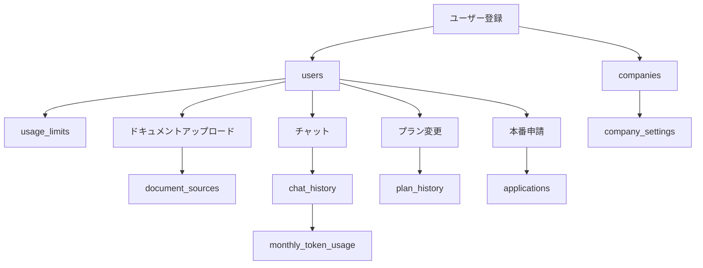

# Workmate-Chatbot データベース設計書

## 概要
**プロジェクト名**: Workmate-Chatbot  
**データベース**: Supabase PostgreSQL 15.8.1  
**プロジェクトID**: lqlswsymlyscfmnihtze  
**リージョン**: ap-northeast-1  

**データベース統計** (過去30日間):
- 総チャット数: 244件
- ユニークユーザー: 12名
- 活動中企業: 5社
- 平均トークン数/チャット: 123.7
- 総トークン使用量: 30,192トークン

---

## テーブル一覧

| テーブル名 | サイズ | 役割 | レコード数 |
|-----------|-------|------|-----------|
| `companies` | 32 kB | 企業情報管理 | 11件 |
| `users` | 48 kB | ユーザー管理 | 19件 |
| `usage_limits` | 64 kB | 使用量制限管理 | 19件 |
| `document_sources` | 1136 kB | ドキュメント管理 | 3件 |
| `chat_history` | 432 kB | チャット履歴 | 244件 |
| `plan_history` | 32 kB | プラン変更履歴 | 21件 |
| `applications` | 48 kB | 申請管理 | 0件 |
| `monthly_token_usage` | 80 kB | 月次トークン使用量 | 6件 |
| `company_settings` | 24 kB | 企業設定 | 3件 |

--

## 1. companies テーブル
**企業情報を管理するマスターテーブル**

| カラム名 | 型 | 制約 | デフォルト | 説明 |
|----------|----|----|----------|-----|
| `id` | text | PRIMARY KEY, NOT NULL | - | 企業ID（一意識別子） |
| `name` | text | NOT NULL | - | 企業名 |
| `created_at` | timestamp | NOT NULL | - | 作成日時 |

**関連テーブル**:
- `users.company_id` → `companies.id` (1対多)
- `document_sources.company_id` → `companies.id` (1対多)

**主要企業データ**:
- ヘルプ (8ユーザー)
- 会社_queue (3ユーザー)
- 11_会社 (2ユーザー)

---

## 2. users テーブル
**ユーザー認証と基本情報を管理**

| カラム名 | 型 | 制約 | デフォルト | 説明 |
|----------|----|----|----------|-----|
| `id` | text | PRIMARY KEY, NOT NULL | - | ユーザーID（一意識別子） |
| `email` | text | UNIQUE, NOT NULL | - | メールアドレス（ログインID） |
| `password` | text | NOT NULL | - | ハッシュ化されたパスワード |
| `name` | text | NOT NULL | - | ユーザー表示名 |
| `role` | text | NOT NULL | 'user' | ユーザー権限（user/admin/employee） |
| `company_id` | text | NULLABLE | - | 所属企業ID（外部キー） |
| `created_at` | timestamp | NOT NULL | - | アカウント作成日時 |
| `created_by` | text | NULLABLE | - | アカウント作成者ID |

**関連テーブル**:
- `companies.id` ← `users.company_id` (多対1)
- `usage_limits.user_id` → `users.id` (1対1)
- `plan_history.user_id` → `users.id` (1対多)
- `document_sources.uploaded_by` → `users.id` (1対多)

**権限レベル**:
- `admin`: 全機能アクセス、ユーザー管理
- `user`: 基本機能、ドキュメントアップロード可能
- `employee`: 閲覧のみ、アップロード不可

---

## 3. usage_limits テーブル
**デモ版の使用制限を管理**

| カラム名 | 型 | 制約 | デフォルト | 説明 |
|----------|----|----|----------|-----|
| `user_id` | text | PRIMARY KEY, NOT NULL | - | ユーザーID（外部キー） |
| `document_uploads_used` | integer | NOT NULL | 0 | 使用済みドキュメントアップロード回数 |
| `document_uploads_limit` | integer | NOT NULL | 2 | ドキュメントアップロード制限回数 |
| `questions_used` | integer | NOT NULL | 0 | 使用済み質問回数 |
| `questions_limit` | integer | NOT NULL | 10 | 質問制限回数 |
| `is_unlimited` | boolean | NOT NULL | false | 無制限プランフラグ |

**関連テーブル**:
- `users.id` ← `usage_limits.user_id` (1対1)

**制限ロジック**:
- デモ版: ドキュメント2回、質問10回まで
- 本番版: `is_unlimited = true` で制限解除

---

## 4. document_sources テーブル
**アップロードされたドキュメントの管理**

| カラム名 | 型 | 制約 | デフォルト | 説明 |
|----------|----|----|----------|-----|
| `id` | text | PRIMARY KEY, NOT NULL | - | ドキュメントID |
| `name` | text | NOT NULL | - | ファイル名 |
| `type` | text | NOT NULL | - | ファイル形式（PDF/EXCEL/CSV等） |
| `page_count` | integer | NULLABLE | - | ページ数（PDFの場合） |
| `content` | text | NOT NULL | - | 抽出されたテキスト内容 |
| `uploaded_by` | text | NOT NULL | - | アップロードユーザーID |
| `company_id` | text | NOT NULL | - | 所属企業ID |
| `uploaded_at` | timestamp | NOT NULL | - | アップロード日時 |
| `active` | boolean | NOT NULL | true | アクティブ状態（検索対象かどうか） |

**関連テーブル**:
- `users.id` ← `document_sources.uploaded_by` (多対1)
- `companies.id` ← `document_sources.company_id` (多対1)

**サポートファイル形式**:
- PDF, Excel (.xlsx/.xls)
- Word (.doc/.docx)
- CSV, テキスト
- 画像ファイル (OCR処理)
- 動画ファイル (音声抽出)

---

## 5. chat_history テーブル
**全チャット履歴とトークン使用量の記録**

| カラム名 | 型 | 制約 | デフォルト | 説明 |
|----------|----|----|----------|-----|
| `id` | text | PRIMARY KEY, NOT NULL | - | チャットID |
| `user_message` | text | NOT NULL | - | ユーザーの質問 |
| `bot_response` | text | NOT NULL | - | AIの回答 |
| `timestamp` | timestamp | NOT NULL | - | 会話発生日時 |
| `category` | text | NULLABLE | - | 質問カテゴリー（自動分類） |
| `sentiment` | text | NULLABLE | - | 感情分析結果 |
| `employee_id` | text | NULLABLE | - | 従業員ID（管理用） |
| `employee_name` | text | NULLABLE | - | 従業員名（管理用） |
| `source_document` | text | NULLABLE | - | 参照したドキュメント名 |
| `source_page` | text | NULLABLE | - | 参照したページ番号 |
| `input_tokens` | integer | NULLABLE | 0 | 入力トークン数 |
| `output_tokens` | integer | NULLABLE | 0 | 出力トークン数 |
| `total_tokens` | integer | NULLABLE | 0 | 合計トークン数 |
| `model_name` | varchar | NULLABLE | 'gpt-4o-mini' | 使用AIモデル |
| `cost_usd` | numeric | NULLABLE | 0.000000 | USD換算コスト |
| `user_id` | varchar | NULLABLE | - | ユーザーID |
| `company_id` | varchar | NULLABLE | - | 企業ID |

**トークン追跡機能**:
- 入力・出力・合計トークンを分離記録
- モデル別コスト計算（USD）
- 会社別・ユーザー別集計可能

---

## 6. plan_history テーブル
**プラン変更履歴の追跡**

| カラム名 | 型 | 制約 | デフォルト | 説明 |
|----------|----|----|----------|-----|
| `id` | text | PRIMARY KEY, NOT NULL | gen_random_uuid() | 履歴ID |
| `user_id` | text | NOT NULL | - | ユーザーID |
| `from_plan` | text | NOT NULL | - | 変更前プラン |
| `to_plan` | text | NOT NULL | - | 変更後プラン |
| `changed_at` | timestamp | NULLABLE | now() | 変更日時 |
| `duration_days` | integer | NULLABLE | - | プラン継続日数 |

**関連テーブル**:
- `users.id` ← `plan_history.user_id` (多対1)

**プラン種別**:
- `demo`: デモ版（制限あり）
- `production`: 本番版（無制限）

---

## 7. applications テーブル
**本番版申請の管理**

| カラム名 | 型 | 制約 | デフォルト | 説明 |
|----------|----|----|----------|-----|
| `id` | text | PRIMARY KEY, NOT NULL | - | 申請ID |
| `company_name` | text | NOT NULL | - | 申請企業名 |
| `contact_name` | text | NOT NULL | - | 担当者名 |
| `email` | text | NOT NULL | - | 連絡先メール |
| `phone` | text | NULLABLE | - | 電話番号 |
| `expected_users` | text | NULLABLE | - | 想定ユーザー数 |
| `current_usage` | text | NULLABLE | - | 現在の利用状況 |
| `message` | text | NULLABLE | - | 申請メッセージ |
| `application_type` | text | NOT NULL | 'production-upgrade' | 申請種別 |
| `status` | text | NOT NULL | 'pending' | 処理状況 |
| `submitted_at` | text | NOT NULL | - | 申請日時 |
| `processed_at` | text | NULLABLE | - | 処理日時 |
| `processed_by` | text | NULLABLE | - | 処理者 |
| `notes` | text | NULLABLE | - | 処理メモ |

**申請ステータス**:
- `pending`: 申請中
- `approved`: 承認済み
- `rejected`: 却下

---

## 8. monthly_token_usage テーブル
**月次トークン使用量の集計**

| カラム名 | 型 | 制約 | デフォルト | 説明 |
|----------|----|----|----------|-----|
| `id` | varchar | PRIMARY KEY, NOT NULL | - | 集計ID |
| `company_id` | varchar | NOT NULL | - | 企業ID |
| `user_id` | varchar | NOT NULL | - | ユーザーID |
| `year_month` | varchar | NOT NULL | - | 年月（YYYY-MM形式） |
| `total_input_tokens` | integer | NULLABLE | 0 | 月次入力トークン合計 |
| `total_output_tokens` | integer | NULLABLE | 0 | 月次出力トークン合計 |
| `total_tokens` | integer | NULLABLE | 0 | 月次合計トークン |
| `total_cost_usd` | numeric | NULLABLE | 0.000000 | 月次合計コスト（USD） |
| `conversation_count` | integer | NULLABLE | 0 | 月次会話回数 |
| `created_at` | timestamp | NULLABLE | CURRENT_TIMESTAMP | 作成日時 |
| `updated_at` | timestamp | NULLABLE | CURRENT_TIMESTAMP | 更新日時 |

**集計ロジック**:
- `chat_history`からトリガーで自動更新
- 企業別・ユーザー別・月別の集計
- 料金計算の基準データ

---

## 9. company_settings テーブル
**企業別の設定管理**

| カラム名 | 型 | 制約 | デフォルト | 説明 |
|----------|----|----|----------|-----|
| `company_id` | varchar | PRIMARY KEY, NOT NULL | - | 企業ID |
| `monthly_token_limit` | integer | NULLABLE | 25000000 | 月次トークン制限（25M） |
| `warning_threshold_percentage` | integer | NULLABLE | 80 | 警告閾値（80%） |
| `critical_threshold_percentage` | integer | NULLABLE | 95 | 重要警告閾値（95%） |
| `pricing_tier` | varchar | NULLABLE | 'basic' | 料金プラン |
| `created_at` | timestamp | NULLABLE | CURRENT_TIMESTAMP | 作成日時 |
| `updated_at` | timestamp | NULLABLE | CURRENT_TIMESTAMP | 更新日時 |

**料金プラン**:
- `basic`: 基本プラン（¥150,000/月、25Mトークン）
- `pro`: プロプラン（従量制あり）
- `enterprise`: エンタープライズプラン

---

## データフロー図



---

## セキュリティとアクセス制御

### Row Level Security (RLS)
現在、全テーブルでRLSは**無効**です。必要に応じて有効化を検討してください。

### 外部キー制約
- `users.company_id` → `companies.id`
- `users.created_by` → `users.id`
- `usage_limits.user_id` → `users.id`
- `document_sources.uploaded_by` → `users.id`
- `document_sources.company_id` → `companies.id`
- `plan_history.user_id` → `users.id`

---

## パフォーマンス最適化

### 推奨インデックス
```sql
-- チャット履歴検索用
CREATE INDEX idx_chat_history_company_timestamp ON chat_history(company_id, timestamp);
CREATE INDEX idx_chat_history_user_timestamp ON chat_history(user_id, timestamp);
CREATE INDEX idx_chat_history_tokens ON chat_history(total_tokens);

-- 月次集計用
CREATE INDEX idx_monthly_usage_company_month ON monthly_token_usage(company_id, year_month);
CREATE INDEX idx_monthly_usage_user_month ON monthly_token_usage(user_id, year_month);
```

---

## 料金計算システム

### トークン料金体系
- **基本プラン**: ¥150,000/月（25Mトークン含む）
- **第1段階**: 25M〜50M → ¥15/1,000トークン
- **第2段階**: 50M〜100M → ¥12/1,000トークン  
- **第3段階**: 100M超 → ¥10/1,000トークン

### AIモデル別料金（USD）
- **gpt-4o-mini**: 入力$0.15/1M, 出力$0.60/1M
- **gpt-4o**: 入力$2.50/1M, 出力$10.00/1M
- **gpt-4**: 入力$30.00/1M, 出力$60.00/1M

---

## 今後の拡張予定

1. **Row Level Security (RLS)** の有効化
2. **監査ログテーブル** の追加
3. **API使用量制限テーブル** の追加
4. **ファイル添付機能** のメタデータ管理
5. **マルチテナント対応** の強化

---

*ドキュメント更新日: 2025年1月* 
